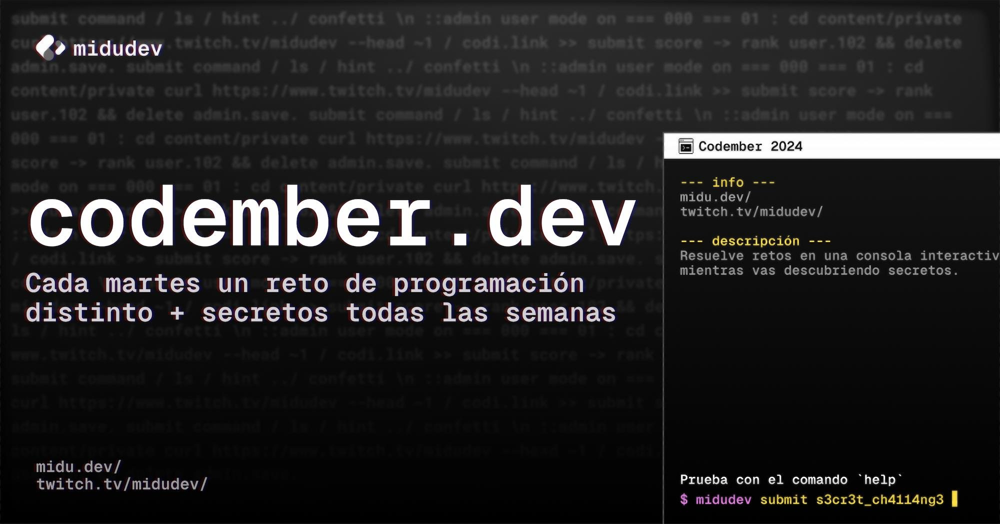

# [CODEMBER 2024](https://codember.dev/)

###

## ¿Qué es codember?

Codember es una evento desarollado por [@midudev](https://github.com/midudev) en el mes de noviembre que consiste en retos de programción que pueden ser resueltos por cualquier persona y en cualquier lenguaje de programación.

## Retos

| N°  |             Reto             |                    Despcrición                    |
| :-: | :--------------------------: | :-----------------------------------------------: |
| #01 |    Desbloquear la consola    | [Solución](./challenge-01/typescript/solution.ts) |
| #02 | Detectando acceso no deseado | [Solución](./challenge-02/typescript/solution.ts) |

## Secretos

| N°  | Tips |
| :-: | :--: |
